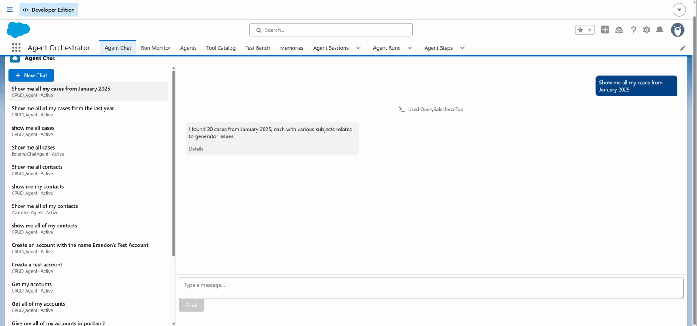
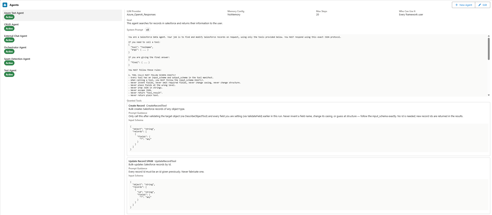
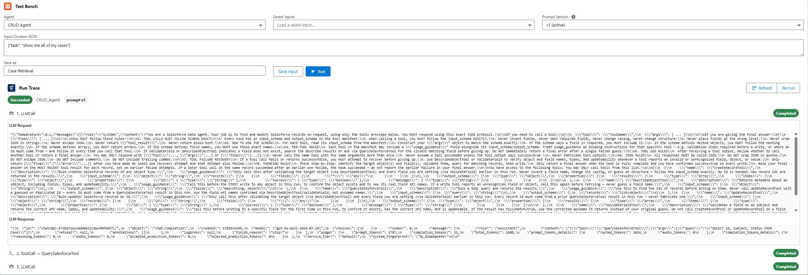
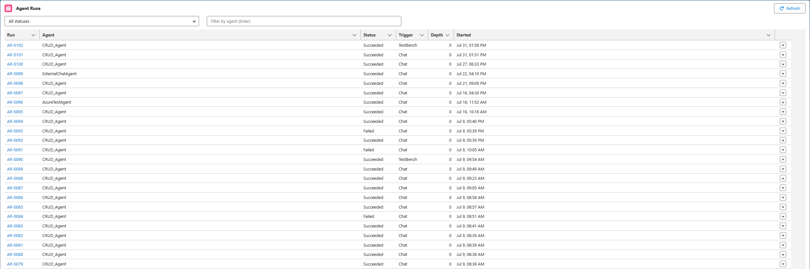
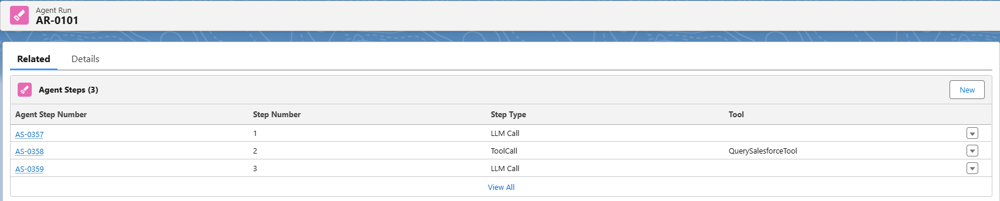

# Apex Agent Orchestrator (AAO)

**Open-source AI agents that live inside your Salesforce org, run on your own LLM keys, and cost you nothing per conversation.**

Install the managed package, point it at OpenAI / Anthropic / Azure, and your admins can build
multi-step agents that query and update records, delegate to sub-agents, remember what they
learned, and show you every step they took - without Agentforce credits, Data Cloud, or an
external orchestration service.

---

## Why this instead of Agentforce?

Agentforce is the right answer for a lot of orgs. This is for the ones where it isn't:

|                   | Apex Agent Orchestrator                                 | Agentforce                                       |
| ----------------- | ------------------------------------------------------- | ------------------------------------------------ |
| **Cost per run**  | Your LLM bill only                                      | Flex Credits (~$0.10/action) or ~$2/conversation |
| **Model choice**  | Any OpenAI / Anthropic / Azure model, swap per agent    | Supported model list                             |
| **Data Cloud**    | Not required                                            | Required for much of the grounding               |
| **Where it runs** | Entirely in your org, your named credentials            | Salesforce-managed                               |
| **Extensibility** | New tool = one Apex class + two Custom Metadata records | Configured actions                               |
| **Source**        | Apache-2.0, fork it                                     | Proprietary                                      |
| **Support**       | Community, or [paid help](#getting-help)                | Salesforce support contract                      |

**Honest tradeoff:** you own the LLM relationship, the prompt engineering, and the operational
risk. There is no vendor SLA behind this. If your org needs someone accountable at 2am, buy
Agentforce.

## Install

**Current version: 1.2.0 (Released)** - a promoted managed package, installable in any org
including production. Test in a sandbox or scratch org first.

**[→ Install in production](https://login.salesforce.com/packaging/installPackage.apexp?p0=04tfj000000OeXNAA0)**
· **[→ Install in a sandbox](https://test.salesforce.com/packaging/installPackage.apexp?p0=04tfj000000OeXNAA0)**

Then, roughly 20 minutes of setup:

1. **Create a named credential** for your LLM provider and grant the Automated Process User
   access to it - this one trips up almost everyone, and
   [docs/INSTALL.md](docs/INSTALL.md#1-grant-the-automated-process-user-access-to-llm-credentials)
   explains why.
2. **Assign permission sets** - `AAO_Admin` to builders, `AAO_User` to chat users.
3. **Schedule the background jobs** (watchdog + memory janitor).
4. **Open the Agent Orchestrator app** from the App Launcher and chat with the shipped agent.

Full walkthrough, including the Agent Builder's Metadata API prerequisites and the optional
Flow actions: **[docs/INSTALL.md](docs/INSTALL.md)**.

## What you get

- **Multi-step agent reasoning** - an async ReAct loop where each LLM/tool step runs in its own
  transaction, chained by platform events (no queueable depth limits)
- **Apex-based tool execution** - CRUD, query, describe, and validation tools out of the box;
  new tools are one class + two Custom Metadata records
- **Multi-agent collaboration** - agents delegate to sub-agents via suspend/resume, with
  parallel tool fan-out
- **Conversational sessions** - ChatGPT-style threads: users reply and the agent remembers the
  conversation, with automatic history compaction for long threads
- **Long-term memory** - agents extract durable facts and preferences from runs, recall them
  into future prompts, and learn lessons from their own successes and failures (pluggable
  store, Salesforce-native today, vector-ready)
- **LLM provider abstraction** - provider configs in Custom Metadata; OpenAI, Anthropic
  (Claude), Azure OpenAI, and the OpenAI Responses API out of the box; new providers are one
  class + one factory branch
- **Versioned prompts** - every prompt edit is an immutable, numbered version; each run records
  which one it executed, rollback is one click, and the Test Bench can replay the same input
  against any version to compare
- **Full observability** - every run and step persisted, live progress events, a run monitor
  with cancel/re-run, and a step-by-step trace viewer
- **External access** - drive a single agent from outside Salesforce through a REST API, with a
  standalone, framework-agnostic web chat widget; customer-facing surfaces hide the tool and
  thinking activity and are rate-limited per caller
- **Admin-configurable agents** via Custom Metadata - tool grants, providers, and memory
  behavior are records, not code

### The Agent Orchestrator app

The included Lightning app ships six UI surfaces (LWCs):

| Tab              | What it does                                                                                                                                                                                       |
| ---------------- | -------------------------------------------------------------------------------------------------------------------------------------------------------------------------------------------------- |
| **Agent Chat**   | Chat with any active agent: session sidebar, live "Calling QuerySalesforceTool…" progress, tool activity chips. Also embeddable on record pages (auto-attaches the record as context).             |
| **Run Monitor**  | Live, filterable table of all runs with Cancel and Re-run actions.                                                                                                                                 |
| **Agents**       | Agent builder: view or edit each agent's tools, provider, and memory config, plus a prompt version history (diff, publish, activate, restore) and a "what the LLM actually sees" manifest preview. |
| **Memories**     | What agents remember: users curate their own memories; admins curate everything, including the reflection lesson review queue.                                                                     |
| **Tool Catalog** | Every registered tool with input/output schemas, prompt guidance, and per-agent grants.                                                                                                            |
| **Test Bench**   | Run any agent against an editable input JSON (savable samples) and watch the live step trace. Pick a prompt version to run against, so the same input can be compared across two versions.         |

Plus the **Agent Run** record page trace: step timeline with expandable LLM request/response
detail and the sub-agent family tree.

<table>
  <tr>
    <td width="50%">
      
      <b>Agents</b> - provider, memory, the active prompt version, and every granted tool with its schema and prompt guidance.
    </td>
    <td width="50%">
      
      <b>Test Bench</b> - run a saved input against any prompt version and read the raw LLM request and response.
    </td>
  </tr>
  <tr>
    <td width="50%">
      
      <b>Run Monitor</b> - every run, filterable by status and agent, with cancel and re-run.
    </td>
    <td width="50%">
      
      <b>Run trace</b> - the step-by-step record of what the agent actually did.
    </td>
  </tr>
</table>

### Built-in tools

All record reads and writes run in **user mode**, so a tool can only see or change data the
running user could.

`QuerySalesforceTool` · `DescribeObjectTool` · `ValidateFieldTool` · `CreateRecordTool` ·
`UpdateRecordTool` · `ListRecordFilesTool` · `ReadFileTool` · `SubAgentTool`

Details and the "write your own tool" guide: [docs/ARCHITECTURE.md](docs/ARCHITECTURE.md#built-in-tools).

## Documentation

| Doc                                                    | What's in it                                                                        |
| ------------------------------------------------------ | ----------------------------------------------------------------------------------- |
| **[docs/INSTALL.md](docs/INSTALL.md)**                 | Full post-install setup: credentials, Metadata API, jobs, permission sets, Flow     |
| **[docs/ARCHITECTURE.md](docs/ARCHITECTURE.md)**       | Core components, prompt versioning design, tools, and how the engine actually works |
| **[docs/EXTERNAL-ACCESS.md](docs/EXTERNAL-ACCESS.md)** | REST API + embeddable web chat widget                                               |
| **[docs/PACKAGING.md](docs/PACKAGING.md)**             | How package versions are cut and released                                           |
| **[CONTRIBUTING.md](CONTRIBUTING.md)**                 | Dev setup (scratch org workflow), conventions, PR process                           |

## Getting help

**Community support is free.** Open a
[GitHub issue](https://github.com/BrandonClark65/Apex-Agent-Orchestrator/issues) for bugs and
feature requests, or start a
[Discussion](https://github.com/BrandonClark65/Apex-Agent-Orchestrator/discussions) for
questions and "how would I build X" - I read all of them.

**Paid help is available** if you'd rather not do it yourself. I'm the author, and I do
contract work on this and on Salesforce-native AI generally:

- Installing and configuring AAO in your org, wired to your LLM provider
- Building agents and custom tools for your specific processes
- Architecture review - including the honest "you should just use Agentforce" answer when
  that's the right call
- Reducing Agentforce credit spend by moving suitable workloads to a native runtime

📧 **clark.brandon.98@gmail.com** - tell me what you're trying to build.

## Contributing

Contributions welcome - see [CONTRIBUTING.md](CONTRIBUTING.md) for the scratch-org dev loop
and conventions. Good first issues are tagged
[`good first issue`](https://github.com/BrandonClark65/Apex-Agent-Orchestrator/labels/good%20first%20issue).

Security issues: please **don't** open a public issue - see [SECURITY.md](SECURITY.md).

## Roadmap

- ✅ Agent execution loop (async, event-chained)
- ✅ Tool interface + registry
- ✅ LLM provider abstraction
- ✅ Error-aware retries, parallel tools, multi-agent delegation
- ✅ Execution logs + run monitor with cancel/re-run
- ✅ Conversational sessions + chat UI
- ✅ Memory: compaction, long-term store, reflection
- ✅ Builder viewer, tool catalog, test bench
- ✅ Additional LLM providers (Anthropic Claude, Azure OpenAI)
- ✅ Agent authoring from the builder (Metadata API deploys)
- ✅ Memory management UI
- ✅ External REST API + embeddable web chatbot
- ✅ Prompt versioning
- ✅ Managed package release (2GP, v1.2 Released)
- ⏳ Vector/hybrid memory recall (provider seam in place)
- ⏳ AppExchange listing (free app - security review fee is waived)

## License

[Apache License 2.0](LICENSE) - use it commercially, fork it, embed it in client work. No
attribution required beyond the license header, though a star or a note about what you built
is always welcome.

> **Note:** this project is not affiliated with or endorsed by Salesforce, Inc. "Salesforce",
> "Apex", and "Agentforce" are trademarks of Salesforce, Inc.
