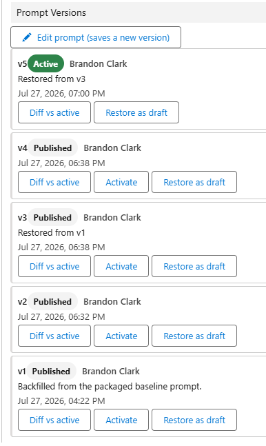
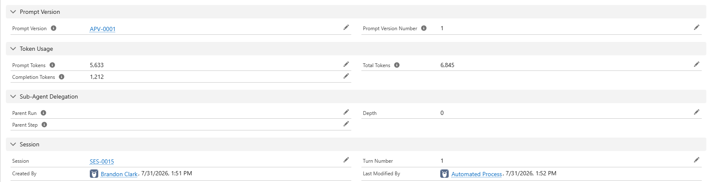

# Architecture

How Apex Agent Orchestrator actually works. If you're just installing it, start with
[INSTALL.md](INSTALL.md) instead.

## Core components

- **AgentEngine** - the execution state machine: `runAgent` (one-shot) and `runAgentInSession` (conversational) entry points, LLM/tool steps, parallel fan-out, sub-agent suspend/resume, cancel guards.
- **ToolRegistry / AgentTool** - discovers and invokes Apex tools; access is granted per agent via `Agent_Tool_Mapping__mdt`.
- **LLMClient / LLMClientFactory** - provider-agnostic LLM interface driven by `LLM_Provider__mdt`; ships `OpenAIClient`, `AnthropicClient`, `AzureOpenAIClient`, and `OpenAIResponsesClient` (Responses API on OpenAI or Azure).
- **PromptVersionService** - resolves which prompt a run executes and owns version authoring (draft, publish, activate, restore). Resolution never throws: any failure falls back to the packaged baseline so versioning can't break a run.
- **PromptVersionBackfill** - `global` entry point that seeds v1 for every agent from the packaged baseline, so subscriber orgs can start prompt history at what shipped. Backs `scripts/apex/BackfillPromptVersions.apex`.
- **AgentDeployService / AgentDeployCallback** - deploys agent definitions and tool grants from the builder UI via `Metadata.Operations`, reporting completion over the UI event channel. Prompts deliberately bypass this path - see [Prompt versioning](#prompt-versioning).
- **MemoryProvider / MemoryService** - pluggable memory store (`Agent_Memory__c` + `SalesforceMemoryProvider` today); recall injects "Relevant memories" and "Lessons from previous runs" into prompts, `MemoryCaptureQueueable` extracts facts and reflections after runs.
- **HistoryCompactor** - summarizes long conversations before they hit the 128KB history ceiling, via a configurable cheap maintenance model.
- **ExecutionLogger** - persists every run (`Agent_Run__c`) and step (`Agent_Step__c`); the single termination choke point that releases sessions, resumes parents, and publishes UI events.
- **UIEventPublisher / Agent_UI_Event\_\_e** - live progress channel the LWCs subscribe to (with polling fallback).
- **AgentChatApi** - external REST boundary (`@RestResource` at `/services/apexrest/agent/*`) mirroring the chat controller for non-Salesforce clients: a single server-resolved agent, `External_Ref__c`-scoped sessions, tool activity hidden from the customer, and per-caller rate limiting. Shares message rendering with the LWC via `ChatMessageRenderer`. See [EXTERNAL-ACCESS.md](EXTERNAL-ACCESS.md).
- **AgentWatchdogSchedulable / MemoryJanitorSchedulable** - hourly timeout of stuck runs and orphaned sessions; nightly pruning of expired/stale memories.
- **Custom Metadata** - `Agent_Definition__mdt`, `Agent_Tool_Definition__mdt`, `Agent_Tool_Mapping__mdt`, `LLM_Provider__mdt`, `Memory_Config__mdt`.

## Why steps are chained by platform events

Each LLM call and each tool call runs in its own transaction, chained by
`Agent_Step_Event__e` rather than by enqueuing the next Queueable directly. Apex caps
Queueable chain depth, which would cap how many reasoning steps an agent could take. Platform
events sidestep that: the trigger enqueues the next step, so the chain length is bounded by
your patience rather than by the platform.

The tradeoff is that the Queueable performing the LLM callout executes as the **Automated
Process User**, not the user who started the run - which is why granting that user access to
your LLM credential is step 1 of
[installation](INSTALL.md#1-grant-the-automated-process-user-access-to-llm-credentials).

## Prompt versioning

A system prompt is the highest-churn thing in an agent, so it is versioned rather than edited in place. Every save creates an **`Agent_Prompt_Version__c`** record: numbered per agent, attributable, and immutable once published (a validation rule blocks edits to a published body - you save a new version instead).



The version history panel in the Agent Builder. Note v5 - "Restored from v3" - which is the
rollback-plus-one-fix case the bullets below describe, and v1, seeded from the packaged
baseline by the backfill script.

- **The active version is what runs.** Exactly one version per agent is active, enforced at the database level by a unique key rather than by convention.
- **`Agent_Definition__mdt.SystemPrompt__c` is now only the packaged baseline** - the fallback the engine uses when an agent has no versions at all. Creating an agent in the builder seeds both the baseline and v1 from the same text; after that the baseline is frozen and edits go through versions. Editing the CMDT field directly has no effect on an agent that has versions.
- **Runs record what they ran.** `Agent_Run__c.Prompt_Version__c` is stamped at run start and honored for the whole run, so activating a new version mid-run doesn't swap the prompt underneath it. A conversation pins on its first turn (`Agent_Session__c.Prompt_Version__c`) so a multi-turn thread can't change prompts halfway through.
- **Rollback is instant.** Activating an older version takes effect on the next run with no metadata deploy. This is the reason versions are ordinary records and not Custom Metadata: Apex cannot DML CMDT, so routing prompt edits through `Metadata.Operations` would make every save _and every rollback_ a ~90 second async deploy.
- **Drafts are the workspace.** A version saved without publishing stays editable and affects nothing. **Restore as draft** copies an older (immutable) version into a new editable one so you can build on it - the usual case being "v6 regressed, v3 was better, but I want v3 plus one fix." Drafts can be edited repeatedly and test-run before you publish.
- **Compare before you commit.** The Test Bench can run a saved input against any version, drafts included, so you can put two traces side by side before making one live.



What that looks like after the fact: the run records which prompt version it executed, so a
trace from six weeks ago still tells you what it ran - alongside token usage and the session
turn it belonged to.

The tradeoff of storing versions as data: they are records, not metadata, so they don't move between orgs with a `sf project deploy`. The packaged baseline still deploys normally, and `scripts/apex/BackfillPromptVersions.apex` recreates v1 in a new org from that baseline.

## The final-answer contract

An agent ends a run by emitting `{"final": { ... }}`. What goes **inside** that object decides
whether the chat window shows a sentence or a wall of JSON, so it is a contract, not a
convention.

```json
{
  "final": {
    "message": "I found 3 open cases from January, all still unassigned.",
    "records": [{ "id": "500...", "subject": "..." }],
    "count": 3
  }
}
```

- **`message` is the prose.** `ChatMessageRenderer` renders it as the chat bubble. It is the
  only part a user reads as text.
- **Every sibling key is structured data.** It rides alongside the answer in `View.data`, and
  the `aaoChatMessage` LWC renders it as a collapsible **Details** block. This is how an agent
  returns records without the bubble becoming a record dump.
- **No prose key means the bubble shows serialized JSON.** That is the deliberate fallback -
  showing something beats showing nothing - but it is a bad chat experience, and the fix is
  the agent's prompt, not the renderer.

For resilience the renderer also accepts `answer`, `summary`, `text`, `response`, and `error`
as the prose key, and unwraps a single-key object holding a bare string. Don't rely on those
in a prompt you control; write `message`.

> **If your agent is answering with raw JSON, this is why.** Its active prompt version doesn't
> ask for `message`. Note that fixing `Agent_Definition__mdt.SystemPrompt__c` only affects
> agents with **no prompt versions at all**, since the CMDT field is just the packaged baseline
>
> - see [Prompt versioning](#prompt-versioning). For an agent that already has versions, save a
>   new version in the Agent Builder and activate it.

## Built-in tools

Each tool is an `AgentTool` implementation registered via an `Agent_Tool_Definition__mdt` record; grant an agent access by adding an `Agent_Tool_Mapping__mdt` record (or from the Agent Builder UI). All record reads and writes run in **user mode**, so a tool can only see or change data the running user could. The framework ships:

- **QuerySalesforceTool** - runs a SOQL query and returns the matching records.
- **DescribeObjectTool** - describes an sObject's fields and types for the model.
- **ValidateFieldTool** - checks that a field API name exists and is accessible on an object.
- **CreateRecordTool** - bulk-creates records of any object type.
- **UpdateRecordTool** - bulk-updates records by Id.
- **ListRecordFilesTool** - lists the files attached to a record (metadata only, no content).
- **ReadFileTool** - reads the text content of a file attached to a record (text-based files only; binary/office/image types are rejected, and oversized files and long text are capped to protect heap and the model's context window).
- **SubAgentTool** - delegates a task to another agent (suspend/resume, depth-capped).

### Writing your own tool

1. Implement `AgentTool` in a new Apex class.
2. Add an `Agent_Tool_Definition__mdt` record pointing `Tool_Class__c` at it, with
   `InputSchema__c` / `OutputSchema__c` describing the contract for the model.
3. Add an `Agent_Tool_Mapping__mdt` record granting a specific agent access - or do it from
   the Agent Builder UI.

Keep all DML and SOQL in user mode. The security model of the whole framework rests on it.

## Permission sets

- **AAO_Admin** - full access: all objects, all tabs, monitoring, builder, test bench.
- **AAO_User** - chat + own memories: start sessions, converse with agents, and curate what agents remember about them.

`AAO_User` grants read access to `Agent_Prompt_Version__c`. Chat users never edit prompts, but
the Agent Builder's version panel and the run trace's version badge both read these records,
so removing that access leaves those surfaces blank for them.

## Restricting an agent to specific users

`AAO_User` is all-or-nothing: it decides whether someone can chat at all, not which agents they
get. By default every active agent is offered to every chat user.

To narrow one, set `Agent_Definition__mdt.Required_Custom_Permission__c` to the API name of a
Custom Permission. Only users who hold that permission can then start or continue a run against
that agent. You can set it from the Agent Builder ("Required Custom Permission" on the agent
form) or directly on the Custom Metadata record. Leave it blank and the agent stays open to
everyone, which is what the packaged agents ship as.

Membership is whatever Salesforce already says it is: create the Custom Permission, add it to a
permission set, and assign that permission set (or a permission set group containing it) to the
users and teams that should get in. There is no separate grant object to keep in sync.

`AgentAccess` is the single decision point. It is consulted in two places:

- `AgentChatController.getAvailableAgents` filters the chat picker, so a restricted agent is
  simply not offered.
- `AgentEngine.runAgent` and `AgentEngine.runAgentInSession` check again before anything is
  created. That is the real boundary: the picker is presentation only, and a hand-built
  `@AuraEnabled`, Flow, or REST call naming a restricted agent is refused the same way. On a
  follow-up turn the check runs against the agent pinned to the session rather than the agent
  name the caller passed, so revoking access also closes threads that are already open.

Two consequences worth knowing before you turn this on:

- **It fails closed.** `FeatureManagement.checkPermission` returns false for a Custom Permission
  that does not exist, so a typo in the field locks the agent for everyone rather than opening
  it. If an agent suddenly vanishes from every picker, check the spelling first.
- **It applies to you too.** There is no admin bypass. Restricting an agent also blocks it in
  the Test Bench and in Run Monitor's rerun until you assign yourself the permission.

Sub-agent delegation is deliberately not gated. Which agents may delegate to which is set by an
admin in `Agent_Tool_Mapping__mdt`, not chosen by the user, so an orchestrator can still hand
work to a restricted agent through `SubAgentTool`. The child run's tools still execute in user
mode, so delegation widens which agent answers, never which data the running user can reach. If
an agent must be unreachable even indirectly, revoke the `SubAgentTool` grant rather than
relying on the permission.

## Apex reference documentation

Apex classes are documented with [ApexDocs](https://github.com/cesarParra/apexdocs) via `/** @description ... */` comment blocks. The generated reference guide is a build artifact (`docs/apex/`, gitignored) - regenerate it locally whenever you want current docs:

```bash
npm install
npm run docs
```

This reads `apexdocs.config.mjs` and writes a Markdown reference guide to `docs/apex/`, grouped by architecture area (Agent Engine, Agent Tools, LLM Integration, Memory, UI, Tests). Open `docs/apex/index.md` as the entry point.

When adding or changing a public class, method, or constructor, add/update its `@description`/`@param`/`@return` ApexDoc comment so the generated docs stay accurate.
